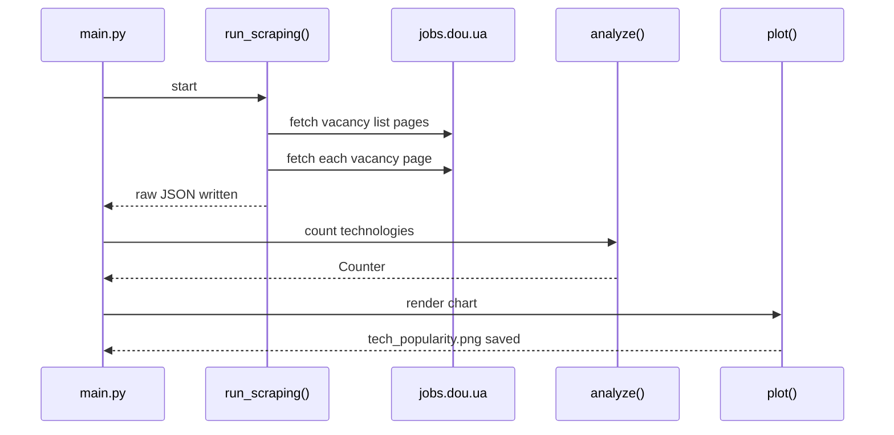
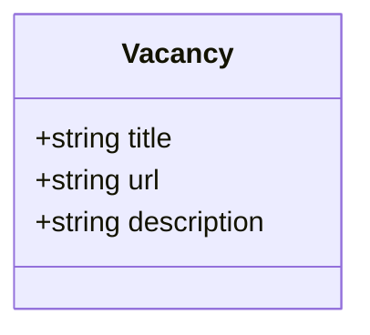

# dou-scrapper-project
This project requires a combination of Web Scraping &amp; Data Analysis skills.  The idea of it is to help you to understand the most demanded technologies on the tech market right now. To become a Python Developer you need to know Django/Flask, Web, PostgreSQL. Even these technologies may not be so popular in the recent moment you search the job.

## Install dependencies

```bash
python -m pip install -r requirements.txt
```

## Diagrams (examples)

### Scraping → analysis → chart pipeline

```mermaid
flowchart TD
  A[main.py] --> B[run_scraping()]
  B --> C[scraper.get_vacancy_links()]
  C --> D[scraper.parse_vacancy()]
  D --> E[data/raw_vacancies.json]
  A --> F[analyze()]
  F --> G[Counter: tech -> count]
  A --> H[plot(counter)]
  H --> I[charts/tech_popularity.png]
```

### Runtime sequence (happy path)



### Data artifact (what gets saved)


