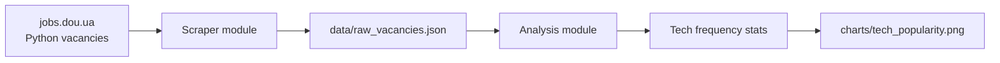
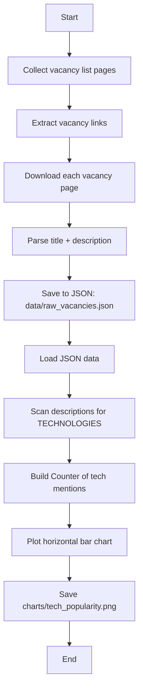

# dou-scrapper-project
This project requires a combination of Web Scraping & Data Analysis skills. The idea is to help you understand the most demanded technologies on the tech market right now. To become a Python Developer you need to know Django/Flask, Web, PostgreSQL. Even these technologies may not be so popular at the moment you search for a job.

The goal is to help Python developers understand which technologies are currently most required on the job market, so they can prioritize what to learn and prepare better for interviews.

---

## 🚀 Project Overview

The project:
- Scrapes public Python job vacancies from dou.ua  
- Extracts technologies mentioned in job descriptions  
- Counts how frequently each technology appears  
- Visualizes popularity statistics using charts  
- Stores historical results to track trends over time  

---

## 🧱 Project Architecture

The project is split into **two independent parts** (Single Responsibility Principle):

### 1️⃣ Scraping Module
- Collects vacancy links
- Downloads job descriptions
- Saves raw vacancy data into JSON

### 2️⃣ Data Analysis Module
- Loads stored vacancy data
- Analyzes technology mentions
- Builds statistics & charts
- Saves visualization results

---

## 🛠 Technologies Used

- Python  
- Requests  
- BeautifulSoup  
- Pandas  
- Matplotlib  
- SQLite (optional storage)  
- Asyncio (optional performance upgrade)  
- NLP tools (optional: nltk, wordcloud)  

---

## 📊 Example Output

The project generates charts showing the **most demanded technologies**:


---

## ⚙️ How to Run the Project

### 1. Clone the repository
```bash
git clone <your-repo-url>
cd dou-scrapper-project
```

### 2. (Recommended) Create and activate a virtual environment

```bash
python -m venv .venv
source .venv/bin/activate  # on macOS / Linux
# .venv\Scripts\activate   # on Windows (PowerShell / cmd)
```

### 3. Install dependencies

Make sure you have Python 3.10+ installed, then run:

```bash
python -m pip install --upgrade pip
python -m pip install -r requirements.txt
```

### 4. Run the scraper + analysis + charts

```bash
python main.py
```

What happens:

- vacancies are scraped from `jobs.dou.ua`
- raw data is saved to the `data` folder
- technologies are counted
- a popularity chart image is generated in the `charts` folder

## Diagrams (examples)

High-level architecture:



Detailed end-to-end flow:



NLP-based technology extraction (no static config)

WordCloud visualization

Experience level segmentation (Junior / Middle / Senior)

Market trend tracking over time

Salary & popularity correlation analysis

⚠️ Disclaimer
Only public job data is scraped

No authentication is used

No private user data is collected

Scraping respects legal and ethical standards

👨‍💻 Author
Roman Azhniuk
Mate Academy — Python Track

⭐ Why This Project Matters
This project helps developers:

Understand real job market demand

Make informed learning decisions

Build strong portfolio projects

Gain real-world scraping & analytics experience
